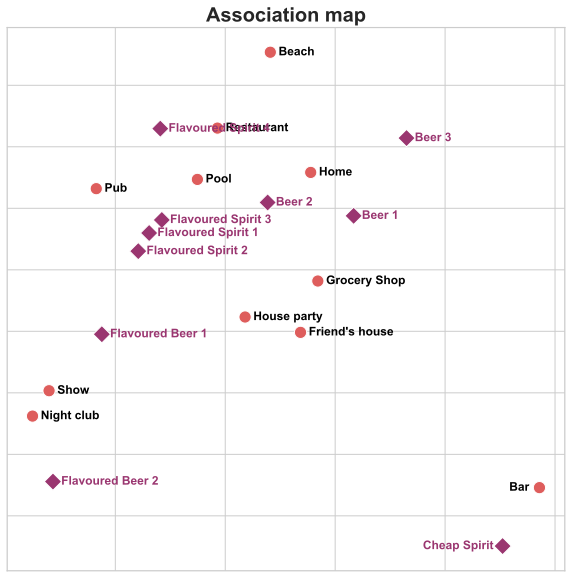

Correspondence Analysis of alcoholic beverages and where to drink


```python
# Importing libs
import numpy as np
import pandas as pd
from prince import CA
import seaborn as sns
import matplotlib.pyplot as plt
%matplotlib inline
```

Importing and processing data


```python

df=pd.read_excel("data\\data.xlsx",sheet_name="data")
""" 
Data from a survey that asked where was the best place (from a list of 11 places) to drink 12 types of alcoolic beverages
 
weight: variable to match the sociodemographic characteristics of the sample to the population
 
Variables with "place" and "drink": each column is a beverage type and it's value is the name of the place if it was select or 0 if it wasnt
Some of the beverages that were in the survey weren't asked in this part so we will have to delete some of the variables
"""
df.head(5)
```


<div>
<style scoped>
    .dataframe tbody tr th:only-of-type {
        vertical-align: middle;
    }

    .dataframe tbody tr th {
        vertical-align: top;
    }

    .dataframe thead th {
        text-align: right;
    }
</style>
<table border="1" class="dataframe">
  <thead>
    <tr style="text-align: right;">
      <th></th>
      <th>ID</th>
      <th>weight</th>
      <th>place_1_drink_11</th>
      <th>place_2_drink_11</th>
      <th>place_3_drink_11</th>
      <th>place_4_drink_11</th>
      <th>place_5_drink_11</th>
      <th>place_6_drink_11</th>
      <th>place_7_drink_11</th>
      <th>place_8_drink_11</th>
      <th>...</th>
      <th>place_3_drink_23</th>
      <th>place_4_drink_23</th>
      <th>place_5_drink_23</th>
      <th>place_6_drink_23</th>
      <th>place_7_drink_23</th>
      <th>place_8_drink_23</th>
      <th>place_9_drink_23</th>
      <th>place_10_drink_23</th>
      <th>place_11_drink_23</th>
      <th>place_12_drink_23</th>
    </tr>
  </thead>
  <tbody>
    <tr>
      <th>0</th>
      <td>1</td>
      <td>0.491357</td>
      <td>0</td>
      <td>0</td>
      <td>0</td>
      <td>0</td>
      <td>Home</td>
      <td>0</td>
      <td>0</td>
      <td>Pub</td>
      <td>...</td>
      <td>0</td>
      <td>0</td>
      <td>0</td>
      <td>0</td>
      <td>0</td>
      <td>0</td>
      <td>0</td>
      <td>0</td>
      <td>0</td>
      <td>None</td>
    </tr>
    <tr>
      <th>1</th>
      <td>2</td>
      <td>0.016819</td>
      <td>0</td>
      <td>0</td>
      <td>0</td>
      <td>Friend\'s house</td>
      <td>Home</td>
      <td>0</td>
      <td>0</td>
      <td>0</td>
      <td>...</td>
      <td>0</td>
      <td>0</td>
      <td>Home</td>
      <td>0</td>
      <td>0</td>
      <td>Pub</td>
      <td>0</td>
      <td>0</td>
      <td>0</td>
      <td>0</td>
    </tr>
    <tr>
      <th>2</th>
      <td>3</td>
      <td>0.109428</td>
      <td>0</td>
      <td>Restaurante</td>
      <td>0</td>
      <td>0</td>
      <td>0</td>
      <td>0</td>
      <td>0</td>
      <td>Pub</td>
      <td>...</td>
      <td>0</td>
      <td>0</td>
      <td>0</td>
      <td>0</td>
      <td>0</td>
      <td>0</td>
      <td>0</td>
      <td>Beach</td>
      <td>Pool</td>
      <td>0</td>
    </tr>
    <tr>
      <th>3</th>
      <td>4</td>
      <td>0.171597</td>
      <td>0</td>
      <td>0</td>
      <td>0</td>
      <td>0</td>
      <td>0</td>
      <td>Show</td>
      <td>0</td>
      <td>0</td>
      <td>...</td>
      <td>Grocery Shop</td>
      <td>0</td>
      <td>0</td>
      <td>0</td>
      <td>House party</td>
      <td>0</td>
      <td>0</td>
      <td>0</td>
      <td>0</td>
      <td>0</td>
    </tr>
    <tr>
      <th>4</th>
      <td>5</td>
      <td>0.425068</td>
      <td>0</td>
      <td>0</td>
      <td>0</td>
      <td>0</td>
      <td>Home</td>
      <td>0</td>
      <td>0</td>
      <td>Pub</td>
      <td>...</td>
      <td>0</td>
      <td>0</td>
      <td>Home</td>
      <td>0</td>
      <td>0</td>
      <td>0</td>
      <td>Bar</td>
      <td>0</td>
      <td>Pool</td>
      <td>0</td>
    </tr>
  </tbody>
</table>
<p>5 rows × 158 columns</p>
</div>


```python
places=12 ### number of places +1
drinks=24 ### number of drinks +1

#* Getting variable names based on number of places and drinks
var_names=[]
for iplaces in range(1,places):
    for idrinks in range(11,drinks):
       var_names.append(f"place_{iplaces}_drink_{idrinks}") 

# Making one column with the values of all variables and changing it's value to binary (1 if they like the mix of the drink with the place) to make it easier to work with weights
df2 = pd.melt(df,id_vars=['ID','weight'],value_vars=var_names, value_name=('place_and_drink')).dropna()
df2.loc[df2['place_and_drink'] != 0, 'place_and_drink'] = 1

# Applying weights
df2['place_and_drink_weighted']=df2['place_and_drink']*df2['weight']
# creating variable for place and drink
for iplaces in range(1,places):    
    for idrinks in range(11,drinks):
        df2.loc[df2['variable']==f"place_{iplaces}_drink_{idrinks}",('drink')]=idrinks
        df2.loc[df2['variable']==f"place_{iplaces}_drink_{idrinks}",('place')]=iplaces
```


```python
# Creating the contingency table
contingency_table = pd.pivot_table(
                  df2, 
                  values='place_and_drink_weighted', 
                  index=['place'],
                  columns=['drink'],
                  aggfunc=np.sum
)
# Labeling
column_names=[
'Beer 1',
'Cheap Spirit',
'Beer 2',
'Flavoured Spirit 4',
'Flavoured Spirit 1',
'Beer 3',
'Flavoured Beer 1',
'Flavoured Beer 2',
'Flavoured Spirit 2',
'Flavoured Spirit 3'
]
row_names=[
'Night club',
'Restaurant',
'Grocery Shop',
'Friend\'s house',
'Home',
'Show',
'House party',
'Pub',
'Bar',
'Beach',
'Pool'
]
contingency_table.columns=column_names
contingency_table.index=row_names

print (contingency_table)
```

                       Beer 1  Cheap Spirit     Beer 2  Flavoured Spirit 4  \
    Night club      26.478609     20.676671  43.091478           47.713263   
    Restaurant      17.921890     11.693016  26.819904           18.017244   
    Grocery Shop    22.493552     19.364991  15.083082           16.266758   
    Friend's house  39.918902     44.001308  42.580234           32.060621   
    Home            64.031607     48.650806  61.656867           53.641644   
    Show            27.684540     13.963411  27.508136           37.897687   
    House party     51.544614     48.517885  55.975748           48.535382   
    Pub             35.998318     15.421897  41.774473           47.647354   
    Bar             48.289090     65.258624  34.797344           16.246760   
    Beach           48.064503     23.881518  45.414532           47.975835   
    Pool            34.260425     20.369498  28.312653           37.654504   
    
                    Flavoured Spirit 1     Beer 3  Flavoured Beer 1  \
    Night club               52.293465  21.838264         67.425072   
    Restaurant               21.601133  22.016729         14.684196   
    Grocery Shop             11.882368  20.750558         16.015937   
    Friend's house           32.921054  40.304902         39.250742   
    Home                     47.428445  70.935777         40.989555   
    Show                     41.971831  19.344083         43.419522   
    House party              50.977284  57.984338         52.732712   
    Pub                      48.736847  23.146361         53.735479   
    Bar                      21.643080  49.197019         17.061331   
    Beach                    40.754239  58.061386         36.246074   
    Pool                     34.029507  31.766884         31.767810   
    
                    Flavoured Beer 2  Flavoured Spirit 2  Flavoured Spirit 3  
    Night club             77.254773           61.829702           46.825487  
    Restaurant             16.892138           22.803723           24.128144  
    Grocery Shop           12.948087           16.553325           18.447623  
    Friend's house         28.953137           34.335514           34.370474  
    Home                   37.996586           55.050935           42.168046  
    Show                   61.369994           38.568415           35.795594  
    House party            56.064868           49.406671           46.087376  
    Pub                    40.119673           50.585301           47.106370  
    Bar                    17.478984           19.331688           19.513807  
    Beach                  28.550059           34.285157           35.017516  
    Pool                   29.179502           35.787582           32.817418  
    

Preparing correspondence analysis


```python
ca=CA(n_components=2,n_iter=10,random_state=18012021)
ca.fit(contingency_table)
ca.row_coordinates(contingency_table)
ca.column_coordinates(contingency_table)
# variation explained by CA.
ca.explained_inertia_

```


    [0.7786441926436779, 0.13732578583501656]


Creating Map


```python
# Creating datasets with the coordinates
coord_x=ca.row_coordinates(contingency_table)
coord_y=ca.column_coordinates(contingency_table)
coord_x.columns=['x','y']
coord_y.columns=['x','y']
# Assigning a series variable to know which coordinate belongs to places/drinks and merging dfs

coord=pd.concat([coord_x.assign(series='place'),coord_y.assign(series='drink')])
plt.figure(figsize=(10,10),dpi=1000,frameon=False)
sns.set_theme(style="whitegrid")
plot = sns.scatterplot(
    x='x',y='y',data=coord,hue='series',s=150,style='series',legend=False,ax=None,palette=sns.color_palette("flare", 2),markers=['o','D']
)

# Adding labels to points
i=-1
for x, y in zip(coord['x'], coord['y']):
    i+=1
    color='black'
    if i>10:    color=sns.color_palette("flare", 2)[1] # Changing drinks colors
    if x!=coord['x'].nlargest(2)[0] and x!=coord['x'].nlargest(2)[1]:
        plt.text(x = x+0.015,y = y-0.0025,s=coord.index[i],weight='bold',color=color)
    elif x==coord['x'].nlargest(2)[0] : # Making all labels fit in the plot
        plt.text(x = x-0.055,y = y-0.0025,s=coord.index[i],weight='bold',color=color)
    else:   plt.text(x = x-0.145,y = y-0.0025,s=coord.index[i],weight='bold',color=color)


# Cleaning axes

plot.set(xticklabels=[])
plot.set(xlabel=None)
plot.set(yticklabels=[])
plot.set(ylabel=None)
# Setting title
plt.title('Association map',weight='bold',size=20)


```


    Text(0.5, 1.0, 'Association map')


    

    

